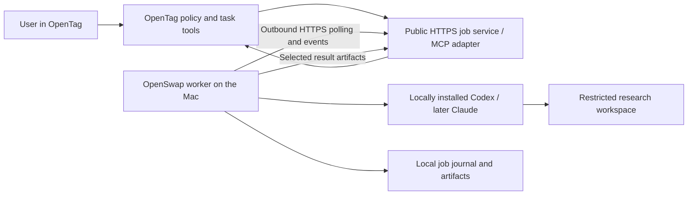

# OpenSwap feature proposal: Remote Agent Host

Status: researched proposal, not implemented. Research date: September 27, 2026.

## Recommendation

Ship **Remote Agent Host as an opt-in OpenSwap feature**, implemented as a separate background worker process. Make OpenTag its first remote client. Keep a versioned worker protocol and provider adapters so the worker can later become a separately installable OpenServer product if demand warrants it.

The user-facing promise: “Send a research task from OpenTag to your Mac, let your locally installed agent work, and get the result back without opening remote desktop.” The Mac must be awake, connected, and authenticated. This is local execution orchestrated remotely; it is not cloud compute and does not make subscription usage unlimited.

Start with a single-owner, macOS, Codex research pilot. Prove account isolation and recovery before adding automatic account selection, multiple simultaneous jobs, or additional providers. Treat Claude subscription support as a separate authentication/product-permission gate. API-backed Claude is a possible later path, with explicit billing and product-scope decisions.

## What the repositories already provide

Inspected local checkouts: OpenSwap `6ec5c71` (main) and the private OpenTag repository. Findings describe these checkouts, not an audit of deployed production. OpenTag-specific code findings and the connector work are tracked in [mar3co/opentag#135](https://github.com/mar3co/opentag/issues/135); only their consequences for OpenSwap are recorded here.

| Existing surface | Consequence for this feature |
| --- | --- |
| OpenSwap is a macOS menu-bar account/usage utility with CLI, widget, kickoff scheduling and login startup | Reuse installation, machine identity UI and local account visibility; keep the worker out of the UI process |
| `src/openswap/kickoff.py` already launches headless provider commands | Useful launch patterns, but not a durable job service |
| Old session-run mode was deliberately removed | Introduce a clearly scoped worker feature; do not silently restore the old session product |
| Account/session helpers exist, with shared settings and other inherited resources | Audit and narrow worker configuration; a separate profile directory is not an OS sandbox |
| OpenTag already calls authenticated remote MCP servers over public HTTPS | An asynchronous MCP adapter is a natural first integration |
| Hosted OpenTag only calls public HTTPS endpoints | It cannot reach a user's laptop or tailnet IP directly; the worker needs a public asynchronous facade |
| OpenTag tool calls have a short per-call budget and bounded responses | Return a job ID promptly, then retrieve status/results separately; never hold one tool call for an entire research run |
| OpenTag's existing write-approval gates are integration-specific | Worker dispatch needs its own approval/policy handling; generic MCP availability is insufficient |
| OpenTag currently gates hosted model spending | Track local agent usage separately from hosted planning/summarization and transport costs |

Repository references: OpenSwap [README](https://github.com/mar3co/openswap/blob/6ec5c71/README.md). OpenTag code references live in [mar3co/opentag#135](https://github.com/mar3co/opentag/issues/135) (private repository).

## Provider feasibility and product differentiation

**Codex:** its local CLI offers noninteractive execution, while app-server offers structured session control. Prefer a pinned, tested CLI adapter for the first bounded research run; assess app-server for later interactive approvals and steering, including its documented experimental/production limitations. Keep any app-server transport local and private. OpenAI documents trusted automation using ChatGPT-managed authentication, but warns against sharing an authentication file across concurrent runners. This supports testing serialized work under a stable local identity; it does not establish safe concurrent account rotation. [Noninteractive mode](https://learn.chatgpt.com/docs/non-interactive-mode), [app-server](https://learn.chatgpt.com/docs/app-server), [automation authentication](https://learn.chatgpt.com/docs/auth/ci-cd-auth).

**Claude:** programmatic execution exists, but technical availability and permitted product authentication are separate. Anthropic permits an end user to sign into an unmodified Claude Code binary, subject to its conditions. Its documentation also restricts third-party collection/intermediation of Claude credentials and directs product developers toward API authentication. The exact OpenSwap/OpenTag wrapper and existing credential storage need review before promising subscription-backed dispatch. Keep provider sign-in in the provider's flow; do not send credentials to OpenTag or the broker. [Legal and authentication guidance](https://code.claude.com/docs/en/legal-and-compliance).

**Native remote products already exist.** Claude Remote Control supports on-demand local sessions and worktree options. Codex also documents remote access. Do not make “use your computer from a phone” the entire differentiation, and do not assume those first-party relays expose supported APIs for OpenTag. Our value is a common task interface, research workflows, account-aware visibility and durable results across providers. [Claude Remote Control](https://code.claude.com/docs/en/remote-control), [Codex Remote](https://learn.chatgpt.com/docs/remote).

Provider web tools can support research, but there is no assumption of parity with a ChatGPT or Claude consumer “deep research” product. Acceptance testing must prove usable search, fetched sources, citations and result quality for the chosen CLI version and permissions.

## Product boundary

| Option | Benefits | Costs | Decision |
| --- | --- | --- | --- |
| Put everything inside the menu-bar process | Few packaging changes | UI restarts affect jobs; account switching and execution become entangled | Reject |
| Bundle a separate worker with OpenSwap | Reuses installation and account UX; isolates lifecycle; supports future extraction | Adds worker management and a small control service | Recommend |
| Launch OpenServer as a new product immediately | Independent identity and cross-platform roadmap | New installer, support surface, onboarding and infrastructure before validating demand | Defer |

OpenSwap owns machine enrollment, local policy, provider adapters and run execution. OpenTag owns requesting work, workspace/user authorization, planning, approval presentation and delivering results. A small control service stores enrollment and job metadata. Keep its protocol independent of OpenTag conversation internals. Neither product runs such a service today: it is new infrastructure with no owner or budget yet. Recommend that OpenTag's hosting operate it, since it already holds tenant authentication and the MCP client, and settle ownership in the feasibility spike before any transport work starts.

Revisit OpenServer when non-OpenTag clients actually adopt the protocol, Linux/headless installations are requested, teams need several worker machines, or worker releases regularly need a different cadence from the account utility. Give it a package boundary now; a separate brand can wait.

## Proposed architecture

Begin with bounded outbound HTTPS polling, heartbeats and event uploads. This avoids inbound ports and does not require a permanent WebSocket in a short-lived request handler. Persist the queue independently of requests. A dedicated relay with WebSockets can follow if measured latency or scale warrants it. Mesh VPN is useful for developer experiments, but hosted OpenTag's network and URL restrictions make it an incomplete production connector by itself.

The worker should run as an opt-in per-user macOS LaunchAgent under the signed-in user. This keeps local keychain access in the expected user context. Quitting the menu-bar UI need not kill work; signing out, rebooting or losing access to the keychain must be reflected in availability. Do not promise pre-login execution or wake-from-sleep behavior in the first release.

First-use flow: enable Remote tasks (the settings label for Remote Agent Host) in OpenSwap, pair a named OpenTag user/workspace, choose an eligible local account and approved research folder, then run a test task. Show the same job ID and stop control in both products. Coordinate helper installation and updates with OpenSwap's existing app-packaging plans 007–008. Keep implementation ownership separate across OpenSwap's MIT and OpenTag's AGPL repositories rather than casually copying code between them.

### Job contract

Proposed tools: `workers_list`, `workspaces_list`, `jobs_submit`, `jobs_get`, `jobs_events` (cursor-based), `jobs_cancel`, `artifacts_list` and `artifacts_get`. Add `jobs_approve` and `jobs_resume` only when the adapter can implement their semantics reliably. These are new interfaces, not existing tools; the supporting reports use the same names.

A submission includes an idempotency key, target worker, provider, task text, predefined capability profile, opaque workspace ID, expiry and runtime limit. The server derives tenant and requesting user from authentication. The worker maps the workspace ID to an approved path. Callers cannot supply arbitrary shell commands, executable paths, environment variables, auth files or unrestricted filesystem paths.

Store the job ID, owner, provider session ID, pinned local account reference, state, lease generation, event cursor, timestamps and artifact metadata. Use `queued`, `claimed`, `starting`, `running`, `waiting_for_approval`, `cancel_requested`, `succeeded`, `failed`, `cancelled`, `interrupted` and `expired`, and track worker connectivity (`online`/`offline`, last seen) separately. `cancel_requested` and the provider's actual stop are different events; `interrupted` covers restarts where the outcome is unknown.

Initially reject submissions to offline workers. The queue handles admission/concurrency and brief delivery interruptions, with a deadline on every job. Deliberately queueing new work for an offline machine is a later opt-in capability. On reconnect, recheck expiry, cancellation, authorization and account readiness before launch.

Use at-least-once delivery with idempotent job creation, a local durable launch journal and lease fencing. Do not claim exactly-once execution. If the worker restarts after launch and cannot determine whether a provider already acted, mark the run interrupted/unknown; reconcile or require an explicit retry instead of blindly rerunning it. Initial process cancellation can use the supervised process group; provider-native interruption is preferable where supported.

### Account behavior

The owner selects an eligible local account before a job starts. Pin that account for the run and serialize runs for each credential profile initially. One active provider job per host is the conservative first pilot limit.

Use stable opaque account identities, not mutable slot numbers: OpenSwap's Codex slots can be moved or swapped. Account removal or reassignment must invalidate queued bindings safely.

Account leases must cover the worker, kickoff scheduler and interactive/autoswitch behavior. Existing saved-account snapshots and process detection are not sufficient evidence of safe sharing. If an interactive session prevents exclusive ownership, queue or reject the remote run. Do not overwrite a live process's auth files, rotate an in-flight conversation, share one subscription across teammates, or retry through a different account to evade a provider limit.

Provider-refreshed credentials must remain authoritative. If isolated credential ownership cannot be proved without conflicting token copies, use the single provider-managed local profile and postpone multi-account execution. Display subscription/API mode and observed usage; do not invent per-job dollar costs for subscription usage. OpenTag's own model calls and hosted service costs remain separate.

### Access and data handling

Pair through a short-lived, one-use code approved locally. Enroll a device key and bind it to a user/workspace. Use expiring, scoped client authorization, revocation and an audit trail; keep provider credentials on the Mac. A workspace membership alone must not grant access to a personal worker. MVP dispatch is owner-only.

Remote policy is the intersection of owner-granted local capabilities, OpenTag user/channel policy and provider permissions. Start with a research profile: approved read access, allowed web tools, and writes only to a dedicated output directory. Prompt instructions alone cannot enforce this. Audit shell access, inherited hooks, skills, MCP servers, plugins and environment variables; enforce restrictions through provider and OS controls that the tested adapter actually supports.

Approve the bounded task before launch. Later sensitive actions should pause for a specific approval that includes job, action and expiry; never resolve approvals automatically after reconnect. If an adapter cannot pause and resume safely, deny unsupported actions. Completion, failure and approval-needed notifications should deep-link to job state and avoid leaking prompts or local paths. Delivery requires the chosen client/channel's notification permissions; a request to notify does not guarantee an OS push.

TLS protects transport. In this MVP the trusted control service can process submitted prompts and selected results; local execution does not mean all data remains local. Upload only explicit result artifacts, with size limits, hashes, access checks, retention and deletion behavior. Treat fetched material and tool output as untrusted content.

## Delivery plan

1. **Feasibility spike and authentication gate.** Pin installed provider versions; test Codex login, headless research, structured events, cancellation and recovery. Prove the selected account is used without changing the user's default login. Inventory auth refresh races and inherited permissions. Resolve Claude's exact permitted integration path separately. Exit: evidence-backed adapter contract and a reproducible local research run.
2. **Local worker.** Add a separate process, local journal, bounded queue, provider adapter, account leases, output directory and basic status UI/CLI. Keep remote access off. Exit: tasks survive UI restart, limits are enforced, and uncertain restarts cannot create duplicate launches.
3. **Private remote pilot.** Add enrollment/revocation, owner-only authorization, durable job service, outbound polling, heartbeats, expiries and result upload. Exit: submit from another network with no inbound port; observe truthful offline state and recover connectivity safely.
4. **OpenTag connector.** Add async tools and a dedicated worker capability scope, approval mapping, worker selector, status/result UI and completion/approval notifications. Register through existing MCP infrastructure while explicitly adding dispatch mutation policy. OpenTag-side scope is tracked in [mar3co/opentag#135](https://github.com/mar3co/opentag/issues/135). Exit: an authorized OpenTag request completes research and returns citations/artifacts through a short initial tool call.
5. **Reliability and expansion.** Add replayable events, resume/steer where supported, measured concurrency, multiple workers and a second provider after its gate clears. Reconsider OpenServer packaging using observed demand.

These are implementation slices, not time estimates. Estimate after the provider/account spike; authentication and lifecycle behavior are the main uncertainty.

## Acceptance criteria

- An owner can remotely submit a research request and receive a cited result from their Mac without remote desktop or an inbound port.
- Duplicate submissions and reconnects produce one logical job; crash reconciliation does not silently launch a second process.
- Sleep/offline produces a visible unavailable/stale state; expired queued work never starts on wake.
- A menu-bar restart does not stop the worker; worker crashes, logout and reboot have explicit recovery outcomes.
- Selected account identity stays fixed; autoswitch/kickoff cannot mutate its credentials while leased; rate limits pause/fail visibly.
- Wrong users/workspaces and revoked devices cannot submit, inspect or approve jobs; revocation prevents new work and has a defined running-job cancellation policy.
- Research cannot escape approved file/tool capabilities; unsupported permissions fail closed; provider credentials never enter remote requests, event logs or artifacts.
- Cancel is idempotent and reported complete only once execution stops. No resumed approval is inferred from elapsed time.
- MCP submit returns promptly within OpenTag's call budget; large output uses bounded artifact retrieval.
- The UI distinguishes provider usage, OpenTag orchestration cost, job failure and provider rate limits. Unsupported provider/version combinations remain disabled.

## Deliberately outside the first release

Cross-platform support; a public agent marketplace; pooled subscriptions; unattended account rotation during a run; remote desktop/browser takeover; arbitrary remote shell; team members spending a personal subscription; automatic deployments or messages; complete consumer deep-research parity; an always-awake guarantee; a separately branded OpenServer launch.

## Research files

Supporting reports: [provider capabilities](research/remote-agent-host/providers.md), [remote architecture](research/remote-agent-host/architecture.md), and [product boundary](research/remote-agent-host/product-boundary.md). Their observations inform this proposal; the scope and release recommendation above are engineering/product judgments, not provider guarantees.
